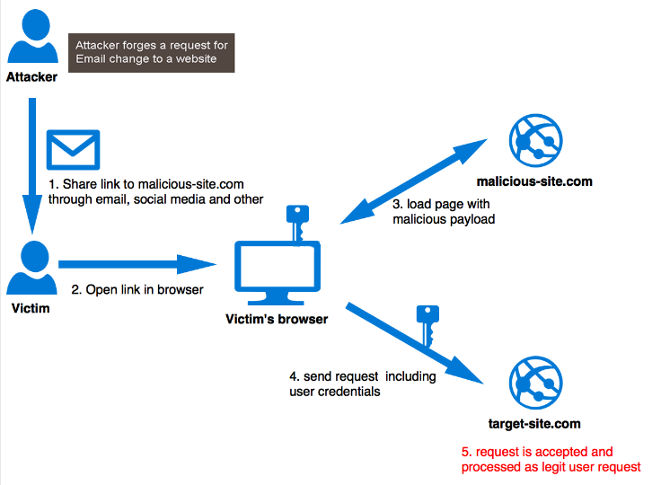

# NodeJS - CSRF Attack

En esta práctica se pretende realizar un ataque CSRF a un servicio de login propio hecho en NodeJS para, posteriormente, solventar con CSRF tokens y así evitar ser atacados.

> Esta práctica se realiza con fines educativos \*guiño\*

## **CSRF**

CSRF (Cross-Site Request Forgery) es un tipo de ataque que se suele usar para estafas por Internet. Los delincuentes se apoderan de una sesión autorizada por el usuario (session riding) para realizar actos dañinos. El proceso se lleva a cabo mediante solicitudes HTTP.

    

## **CSRF Tokens**

Un token CSRF es un valor único, secreto e impredecible que es generado por la aplicación del lado del servidor y transmitido al cliente de tal manera que se incluye en una solicitud HTTP posterior realizada por el cliente. Cuando se realiza la solicitud posterior, la aplicación del lado del servidor valida que la solicitud incluya el token esperado y rechaza la solicitud si el token falta o no es válido.

Los tokens CSRF pueden prevenir los ataques CSRF al hacer imposible que un atacante construya una petición HTTP totalmente válida y adecuada para alimentar a un usuario víctima. Dado que el atacante no puede determinar o predecir el valor del token CSRF de un usuario, no puede construir una solicitud con todos los parámetros necesarios para que la aplicación atienda la solicitud.

    

## Paquetes utilizados

-   express
-   express-session
-   express-handlebars
-   connect-flash-plus

Instálalos mediante el comando `npm install`
